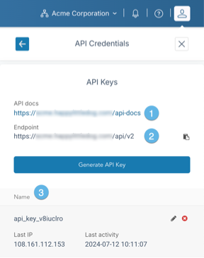

This article provides details on CloudOps API credentials, and how to manage them.

## Overview

When working with the CloudOps API, you will need to generate an API key for use with your code. API keys provide a convenient method for your application to identify itself to a service when making calls to the service's API.

Any CloudOps user may generate an API key. A user's API keys will have the same level of privilege that the user has. There is no limit to the number of API keys that a user may generate. It is recommended to take advantage of this by generating an API key for each application that will be accessing the system.

API keys are created and managed in the **User Settings** panel, under the **API Credentials** section.

1.  **User Settings menu**

    Click this menu button to expose the User Settings panel.

2.  **API Credentials**

    Click on this to enter the API Credentials section of the User Settings panel.

## List existing API keys and endpoints

1.  **Link to the API documentation**

    Click on this link to open the CloudOps API documentation in a new tab.

2.  **URL of the API endpoint**

    Use this URL to access the CloudOps API.

3.  **Existing keys**

    All existing keys will be listed in this area of the panel. Each entry will have the name of the key, the IP address of the last client to use this key, and a timestamp of the last time the key was used. Click on the pencil icon to rename the key, or on the red circle icon to delete the key.

## Generate a new API key

See [Generate a CloudOps API key](../how-to/how-to-cloudmc-api-key).

## Delete an API key

1.  In the API Credentials panel, scroll down to see the existing keys and identify the API key to delete.
2.  Click the red circle icon on the far right side of the desired entry.
3.  A confirmation dialog box will appear. Click **Delete** to complete the operation.
4.  The API key will be deleted immediately. It will disappear from the list of existing keys. Any attempt to login with that key will return an HTTP 401 error, and the body of the response will indicate invalid credentials.

