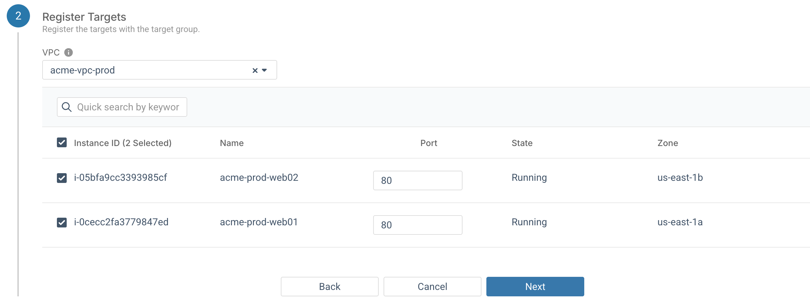
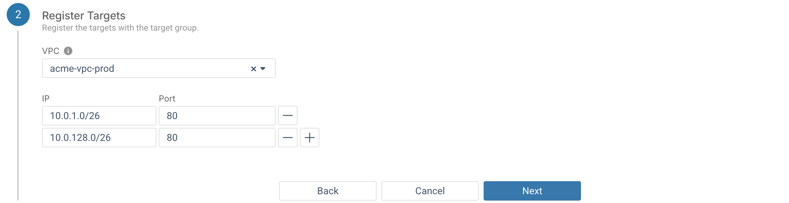

## About this task

This article will guide you through the steps required to create a new target group in your AWS environment.

## Before you begin

-   You must have an AWS environment with one VPC
-   The VPC must have at least two subnets
-   Each subnet must be in a separate availability zone
-   There must be at least one instance in each of the subnets to add as a target

## Procedure

1.  Navigate to your AWS environment, then to **Load Balancing** &gt; **Target Groups**, and click on **Add Target Group**.

2.  When the **Add Target Group** wizard appears, enter a name for the new target group into the **Target Group Name** field.

3.  In the **Target Type** field, select whether the targets you wish to register are instances or a list of IP addresses.

4.  The **Protocol** field allows you to specify whether the load balancer will use HTTP or HTTPS to communicate with the registered targets, and the **Port** field allows you to override the default port for the selected protocol.

5.  Select between these protocol versions for communication between the load balancer and the registered targets:

    -   HTTP/1.1
    -   HTTP/2
    -   GRPC
6.  Select whether the targets use IPv4 addresses or IPv6.

    All the targets in a target group must use the same IP address type. Also, only dualstack load balancers support IPv6 addressing.

7.  \(Optional\) Health check, see next section.

8.  \(Optional\) You may also specify name-value pairs to tag your target group.

9.  Click the **Next** button. The **Register Targets** section appears.

10. Selection of targets for the group will be different depending on the target type of the group:

    **Instances**: Select the VPC with the desired target instances, then mark the checkbox for each of the instances to register with the target group. Once an instance is selected, the port to send traffic to on that individual instance may be overridden with the **Port** field.

    

    **IP address\(es\)**: Enter the IP address for each destination target. Every address must be in the selected VPC. You cannot enter a block of addresses, an address in another VPC, or a publicly routed IP address.

    

11. Click the **Next** button, then the **Submit** button.

## Results

-   The target group will be created with the specified instances or IP addresses
-   The group now appears on the **Target Groups** page

