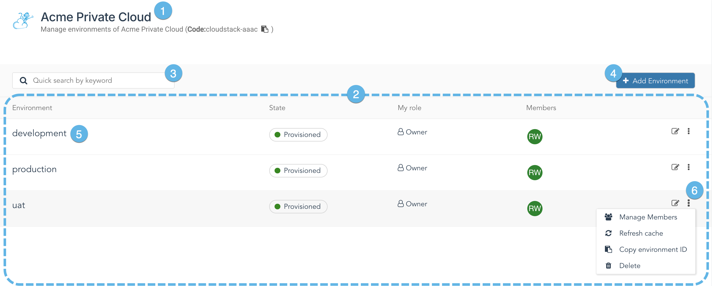
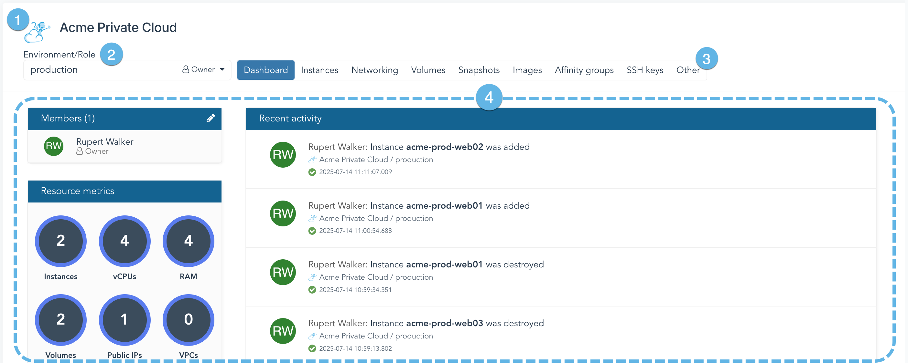
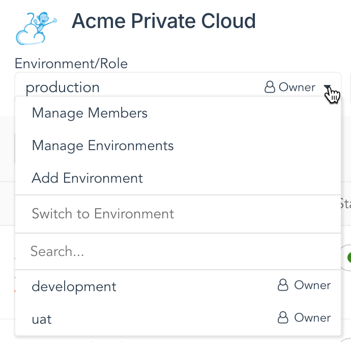

This article introduces the concept of environments in CloudOps, how they relate to service connections, and how to use them to organize your users and workloads.

## Overview

In CloudOps, service connections \(or, simply *services*\) provide the mechanism for connecting to a remote service such as a cloud provider. To access the resources provided by the remote service, CloudOps users interact with an entity called an environment, which exists inside of a service connection. Each environment has its own resources, separate from all other environments, even those that are in the same service connection. This enables the existence of distinct environments to isolate production workloads from development systems, or to establish project-specific sandboxes. Additionally, an environment is accessible only to users that have been added to the environment as members, or to those users whose level privilege overrides the default behavior.

Environments act as logical containers, abstracting functionality which may vary greatly between different types of service connections. For more information on which entities an environment maps to in a specific service, refer to that service's Overview article. Furthermore, the system calculates service usage at the organization-level for billing purposes, and the resources consumed by each environments are also tracked separately, which allows businesses to generate internal chargeback reports on a per-environment basis if they wish.

There are two methods for adding environments, depending on the service connection:

-   Create a new empty environment, which will be provisioned accordingly in the remote service.
-   Create a link to resources which already exist in the remote service, which will appear in CloudOps as an environment

Not all service connections will support both of these methods. Additionally, environments which link to existing resources will normally be created for you by your administrator.

## Accessing environments

Environments are accessed by navigating to the **Services** menu, then clicking on the desired service, which leads to the **Environments** page for that service. This page lists all environments in the selected service that are visible to the current user:

1.  **Service identifier**

    Displays the name of the currently selected service connection. Additionally, this section displays the code to use for accessing this service connection via the CloudOps API.

2.  **List of environments**

    In the main area of the workspace, a list of all environments in the selected service appears.

3.  **Search box**

    Type in the search box to filter the environments list. The system will search through the environment name fields, and returns any instance that matches the string in the search box.

4.  **Add Environment**

    Clicking this button will open the **Add Environment** wizard.

5.  **Environment entry**

    Each entry includes the name of the environment, its state, the environment role you have been assigned for the environment, and a summarized list of the avatars for the members that have been added. Click on an entry to see the resources inside the environment.

6.  **Hidden Actions menu**

    Each entry in the environments list has a Hidden Actions menu. Click on the Hidden Actions menu to access a list of frequently-used operations for the environment.

## Membership, environment roles, and restricted environments

An environment belongs to an organization, and is contained within a particular service. However, unless specifically configured, not all users inside that organization will have access to that environment. Users must first be added as members. To add or delete members from an environment, use its Hidden Actions menu and select **Manage Members**. Alternatively, from within an environment the <a href="#environment-menu">Environment menu</a> also gives access to the **Manage Members** page.

Environment membership is coupled with an environment role. The environment role controls what a user can do with the resources contained in the environment. The system provides basic environment roles, and your administrator may define custom environment roles tailored to your needs. Certain system roles also grant visibility into environments for users with higher levels of privilege, even if they aren't members of a given environment. See [Role-based access controls](../administration/rbac.md) for more information on system and environment roles.

When creating a new environment, two options are available which relate to access control. First, an option is available to **allow external members** to be assigned to the environment. If this option is enabled, the **Add member to environment** pop-up menu will accept usernames from other organizations when typed into the pop-up menu's search field.

The second option, **Restricted environment**, modifies the ability of a user with the Administrator primary role \(or a custom role with the **Admin:Environments: Own all** permission\) to interact with that environment and to assign environment roles to members. When this option is selected, a pop-up menu will appear and allow the creator of the environment to select from a list of environment roles. Once the environment is created, users with the Administrator primary role \(or a custom role with the **Admin:Environments: Own all** permission\) will only see the selected environment roles on the **Manage Members** page. They will also not have full access to the environment, will not be able to delete the environment or to modify the environment name, description, or default role. Note that restricted environments do not apply to a Reseller user.

To automatically grant membership to all user accounts in the organization which owns the environment, click on the **All users \(Auto-membership\)** item from the **Add member to environment** pop-up menu on the **Manage Members** page. You will be prompted to select the role that will be assigned to these members. If a member is specifically added to an environment with auto-membership enabled, the role assigned to the member will take precedence over the role assigned by auto-membership.

## Inside an environment

1.  **Service identifier**

    Displays the name of the service connection where this environment resides.

2.  **Environment menu**

    See the <a href="#environment-menu">Environment menu</a> section for more information.

3.  **Feature toolbar**

    Allows a user to navigate to the environment's dashboard page, as well as to various other pages that expose the features available through this service connection.

4.  **Additional information**

    The rest of the Dashboard provides additional information on the membership, available resources, and recent activity within the environment.

Depending on the type of service, the feature toolbar will display different items exposed by the service. However, all services will have a dashboard page. The default page when entering an environment will vary by service type.

## Environment menu

Use the environment menu to quickly switch between environments in the same service connection, and to access environment management features:

-   The **Manage Members** item will jump to the **Manage Members** page
-   The **Manage Environments** item will return the user to the environments page for the current service connection
-   **Add Environment** will open the **Add Environment** wizard for the current service connection
-   The remaining items in the menu allow the user to search for environments in the current service connection, or to select one directly from a list

-   **[Create a new environment](create-a-new-environment.md)**  

