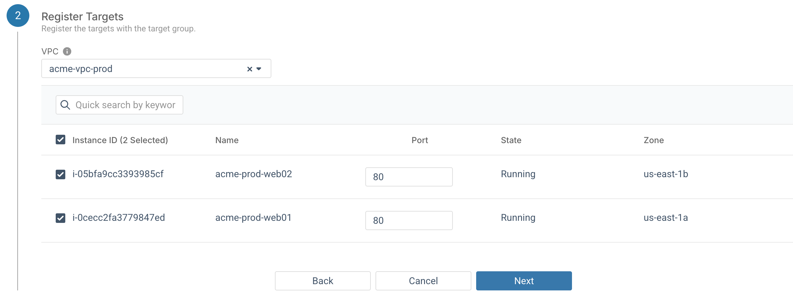
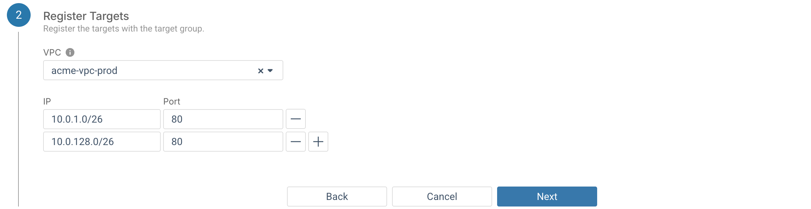

## Acerca de esta tarea

Este artículo te guiará por los pasos necesarios para crear un nuevo grupo de destino en tu entorno de AWS.

## Antes de comenzar

- Debes tener un entorno de AWS con una VPC
- La VPC debe tener al menos dos subredes
- Cada subred debe estar en una zona de disponibilidad independiente
- Debe haber al menos una instancia en cada subred para agregarla como destino

## Procedimiento

1. Ve a tu entorno de AWS, luego a **Equilibrio de Carga** > **Grupos de Destino** y haz clic en **Añadir un grupo de destino**.

2. Cuando aparezca el asistente **Añadir Grupo de Destino**, introduce un nombre para el nuevo grupo de destino en el campo **Nombre del grupo de destino**.

3. En el campo **Tipo de Destino**, selecciona si los destinos que deseas registrar son instancias o una lista de direcciones IP.

4. El campo **Protocolo** permite especificar si el equilbriador de carga utilizará HTTP o HTTPS para comunicarse con los destinos registrados, y el campo **Puerto** permite anular el puerto predeterminado para el protocolo seleccionado.

5. Selecciona entre estas versiones de protocolo para la comunicación entre el equilibriador de carga y los destinos registrados:

    -   HTTP/1.1
    -   HTTP/2
    -   GRPC
6. Selecciona si los destinos utilizan direcciones IPv4 o IPv6.

    Todos los destinos de un grupo de destinos deben utilizar el mismo tipo de dirección IP. Además, solo los equilibriadores de carga dualstack admiten el direccionamiento IPv6.

7. \(Opcional\) Comprobación de estado (consulta la siguiente sección).

8. \(Opcional\) También puedes especificar pares nombre-valor para etiquetar tu grupo de destino.

9. Haz clic en el botón **Siguiente**. Aparecerá la sección **Registrar destinos**.

10. La selección de destinos para el grupo variará según el tipo de destino:

    **Instancias**: Selecciona la VPC con las instancias de destino deseadas y marca la casilla de verificación de cada instancia que deseas registrar en el grupo de destino. Una vez seleccionada una instancia, el puerto al que se enviará el tráfico en esa instancia individual puede sobrescribirse con el campo **Puerto**.

    

    **Dirección IP\(es\)**: Introduce la dirección IP de cada destino. Todas las direcciones deben estar en la VPC seleccionada. No se puede introducir un bloque de direcciones, una dirección en otra VPC ni una dirección IP enrutada públicamente.

    

11. Haz clic en el botón **Siguiente** y luego en **Aplicar**.

## Resultados

- El grupo de destino se creará con las instancias o direcciones IP especificadas.
- El grupo aparecerá en la página **Grupos de destino**.