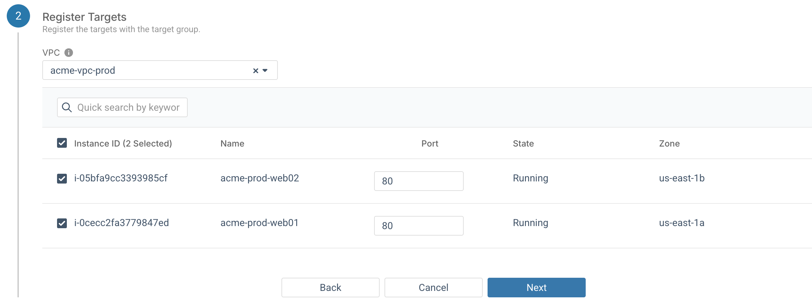
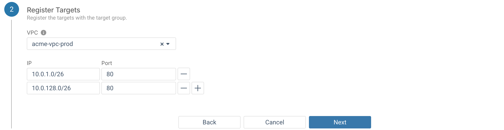

## À propos de cette tâche

Cet article vous guidera à travers les étapes nécessaires à la création d'un nouveau groupe cible dans votre environnement AWS.

## Avant de commencer

- Vous devez disposer d'un environnement AWS avec un VPC
- Le VPC doit avoir au moins deux sous-réseaux
- Chaque sous-réseau doit être dans une zone de disponibilité distincte
- Il doit y avoir au moins une instance dans chacun des sous-réseaux à ajouter comme cible

## Procédure

1. Accédez à votre environnement AWS, puis à **Équilibrage de charge** &gt; **Groupes cibles**, puis cliquez sur **Ajouter un groupe cible**.

2. Lorsque l'assistant **Ajouter un groupe cible** s'affiche, entrez un nom pour le nouveau groupe cible dans le champ **Nom du groupe cible**.

3. Dans le champ **Type de cible**, sélectionnez si les cibles que vous souhaitez enregistrer sont des instances ou une liste d'adresses IP.

4. Le champ **Protocole** vous permet de spécifier si l'équilibreur de charge utilisera HTTP ou HTTPS pour communiquer avec les cibles enregistrées, et le champ **Port** vous permet de remplacer le port par défaut pour le protocole sélectionné.

5. Choisissez entre ces versions de protocole pour la communication entre l'équilibreur de charge et les cibles enregistrées :

    -    HTTP/1.1
    -    HTTP/2
    -    GRPC
6. Sélectionnez si les cibles utilisent des adresses IPv4 ou IPv6. 

    Toutes les cibles d'un groupe cible doivent utiliser le même type d'adresse IP. De plus, seulement les équilibreurs de charge dualstack prennent en charge l'adressage IPv6.

7. \(Optionnel\) Vérification de l'état de santé, voir la section suivante.

8. \(Optionnel\) Vous pouvez également spécifier des paires nom-valeur pour étiqueter votre groupe cible.

9. Cliquez sur le bouton **Suivant**. La section **Enregistrer les cibles** apparaît.

10. La sélection des cibles pour le groupe sera différente selon le type de cible du groupe :

    **Instances** : Sélectionnez le VPC avec les instances cibles souhaitées, puis cochez la case de chacune des instances à enregistrer auprès du groupe cible. Une fois qu'une instance est sélectionnée, le port vers lequel envoyer le trafic sur cette instance individuelle peut être remplacé par le champ **Port**.

    

    **Adresse IP\(es\)** : Entrez l'adresse IP de chaque cible de destination. Chaque adresse doit être dans le VPC sélectionné. Vous ne pouvez pas saisir un bloc d’adresses, une adresse dans un autre VPC ou une adresse IP acheminée publiquement.

    

11. Cliquez sur le bouton **Suivant**, puis sur le bouton **Valider**.

## Résultats

- Le groupe cible sera créé avec les instances ou adresses IP spécifiées
- Le groupe apparaît maintenant sur la page **Groupes cibles**