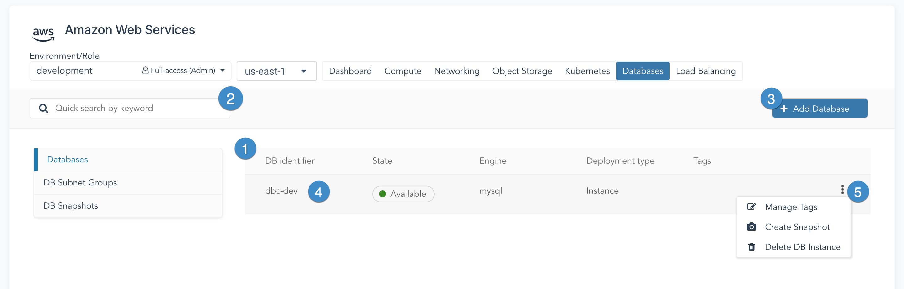

La plateforme CloudOps vous permet d'utiliser le service de base de données géré AWS Relational Database Service (RDS) pour déployer facilement une instance de base de données dans votre environnement.

## Aperçu

Amazon Relational Database Service fournit des bases de données gérées pratiques en tant que service, qui peuvent être utilisées comme n'importe quelle autre base de données, et sans avoir à exploiter et à maintenir un système de gestion de base de données relationnelle complexe (SGBDR). Un utilisateur RDS accède à la base de données via un point d'accès réseau à l’aide d’un client ou d’un connecteur de base de données. Pendant ce temps, AWS s'occupe des licences, des sauvegardes et d'autres tâches opérationnelles.

Pour accéder aux fonctionnalités RDS, accédez à l’environnement AWS souhaité et cliquez sur l’onglet **Bases de données**.

1. **Liste des instances de base de données**

Dans la zone principale de l'espace de travail, une liste de toutes les instances de base de données dans l'environnement sélectionné apparaît.

2. **Zone de recherche**

Tapez dans la zone de recherche pour filtrer la liste des instances de base de données. Le système va chercher dans les champs d'identifiants de la base de données et retourner n'importe quelle base de données correspondant à la chaîne dans la zone de recherche.

3. **Ajouter une base de données**

Cliquer sur ce bouton ouvrira la page **Ajouter une base de données**.

4. **Entrée d'instance de base de données**

Chaque entrée inclut l'identifiant \(nom\) de la base de données, son état, le moteur de base de données en cours d'exécution et si la base de données est une instance ou un cluster.

5. **Menu des actions cachées**

Chaque entrée dans la liste des bases de données a un menu des actions cachées. Cliquez sur le menu des actions cachées pour accéder à une liste d'opérations fréquemment utilisées pour la base de données, notamment la gestion des étiquettes, la création des copies instantanées et la suppression de l'instance.

Lors du déploiement d'une instance RDS, vous choisirez un groupe de sous-réseaux de base de données dans lequel l'instance résidera. Le groupe de sous-réseaux de base de données doit contenir au moins deux sous-réseaux. Ces deux sous-réseaux doivent se trouver dans des zones de disponibilité distinctes et doivent avoir des CIDR non chevauchants. Au moment de la création, vous pouvez choisir parmi les attributs suivants pour l'instance :

- Type de moteur de base de données
- Type d'instance
- Type et taille du volume racinaire
- Mise à l'échelle automatique pour le stockage
- Groupe de sous-réseaux de bases de données
- Identifiants pour se connecter à l'instance de base de données

## Instantanés de base de données

Pour conserver l'état de votre instance de base de données à un moment précis, vous pouvez prendre une copie instantanée. Elle ne s'agit pas d'une sauvegarde de la base de données, mais plutôt d'une image de l'instance entière et de toutes les bases de données qui ont été déployées à l'intérieur de cette instance. Les copies instantanées ne sont pas destinées à une utilisation à long terme. De plus, des frais seront appliqués pour chaque copie instantanée enregistrée.

Les copies instantanées peuvent être créées via le menu des actions cachées de l'instance souhaitée et en sélectionnant **Créer une copie instantanée**.

